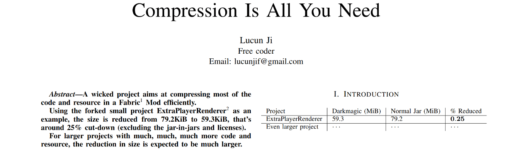

# Compression Is All You Need

A wicked project aims at compressing most of the code & resource in a Fabric Mod efficiently.

Using the forked small project [ExtraPlayerRenderer](https://github.com/LucunJi/ExtraPlayerRenderer) as an example,
the size is reduced from *79.2KiB* to *59.3KiB*, that's around 25% cut-down (excluding the jar-in-jars and licenses).

For larger projects with much, much, much more code and resource, the reduction in size is expected to be much larger.

The project title and banner serve as a harmless mockery.

## Builds

Find in [Releases](https://github.com/LucunJi/Compression-Is-All-You-Need/releases),
or latest builds in [GitHub Actions](https://github.com/LucunJi/Compression-Is-All-You-Need/actions) (may expire).

Or build on your own:
`./gradlew build`

The output is located at `build/libs/xxx-darkmagic-xxx.jar`

## How it works?

At `preLaunch` entrypoint, the compressed code and resources are extracted,
then Classloader, mod information, mixins will be updated.

See code in [src/main/java/github/io/lucunji/explayerenderer/bootstrap](src/main/java/github/io/lucunji/explayerenderer/bootstrap)
for how it loads,
and tasks in [build.gradle](build.gradle) for how the Jar is built.

Note: Apache Commons Compress that I used to extract `.tar` archives is only available on client side.
To make this work on server side, jar-in-jar is needed, which may cause an additional 1MiB space usage.

## License

I don't expect someone will use this weird code in some day, but well, who knows?

The code related to building and launching special jars are released under **Unlicense**,
all other code remains in **LGPL-3.0-or-later** (LGPL 3.0+).

See the LICENSE, LICENSE-LGPL, LICENSE-UNLICENSE files at project root for detailed explanation.
